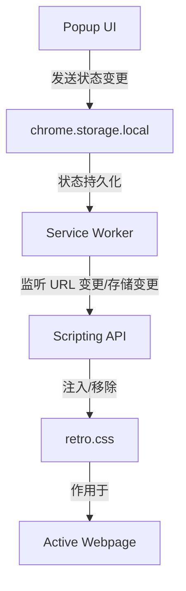

# 技术设计文档 - Y2K-ifier

## 概述
**Y2K-ifier** 是一个基于 Chrome Extension Manifest V3 的纯前端插件。它通过注入专门设计的 CSS 样式表，在不改变现代网页结构的情况下，实现视觉上的“2000年代化”。该设计采用模块化结构，将样式定义、注入逻辑和用户界面分离。

## 指导文档对齐
由于本项目目前处于初期阶段，尚未建立正式的 `tech.md` 或 `structure.md`，本项目将遵循标准的 Chrome 扩展开发模式。

## 代码复用分析
目前仓库为空，没有现成的代码可供复用。我们将从零开始构建。

## 架构设计
本插件将由三个核心模块组成：
1.  **Popup (用户界面)**：提供一个简单的 HTML/CSS 开关，允许用户控制复古模式。
2.  **Service Worker (后台逻辑)**：监听浏览器事件（如标签页更新），并根据存储的状态管理 CSS 的注入。
3.  **Content Scripts (内容注入)**：负责实际将 `retro.css` 注入到目标网页。



## 组件与接口

### 1. Popup 模块
-   **目的**：提供用户控制开关。
-   **接口**：
    -   `onToggleChange(state)`：更新 `chrome.storage.local` 中的 `isEnabled` 标志。
-   **依赖**：`chrome.storage` API。

### 2. Service Worker (background.js)
-   **目的**：全局状态监听与自动注入管理。
-   **接口**：
    -   `handleStorageChange()`：当用户在 Popup 中切换状态时，立即在当前标签页应用或移除样式。
    -   `handleTabUpdate()`：当新页面加载时，检查状态并决定是否注入样式。
-   **依赖**：`chrome.tabs`, `chrome.scripting`, `chrome.storage` APIs。

### 3. Retro Stylesheet (retro.css)
-   **目的**：定义所有的“手术级”复古样式。
-   **核心选择器**：
    -   `button`, `input[type="button"]`：3D 灰色凸起。
    -   `h1`, `h2`, `h3`：Times New Roman 字体覆盖。
    -   `a`：强制下划线与蓝色。
    -   `img`：CSS 滤镜叠加。

## 数据模型

### 状态模型
```json
{
  "isEnabled": "boolean"  // 默认为 true
}
```

## 错误处理

### 错误场景
1.  **场景 1：权限不足**
    -   **处理**：在 `manifest.json` 中明确声明 `scripting` 和 `storage` 权限。
    -   **用户影响**：如果权限配置不当，样式将无法注入。
2.  **场景 2：样式冲突**
    -   **处理**：使用极其具体且带有 `!important` 的选择器，并定期通过测试优化选择器。
    -   **用户影响**：部分现代网页的高度复杂样式可能无法被完全覆盖。

## 测试策略

### 单元测试
-   测试 `chrome.storage` 的读取与写入逻辑是否正确。

### 集成测试
-   验证从 Popup 切换状态后，Service Worker 是否能正确触发 `chrome.scripting.insertCSS`。

### 端到端测试 (E2E)
-   在主流网站（如 Google, Baidu, Wikipedia）上运行插件，通过 `cursor-browser-extension` 验证按钮、文字和滚动条是否呈现复古视觉效果。
