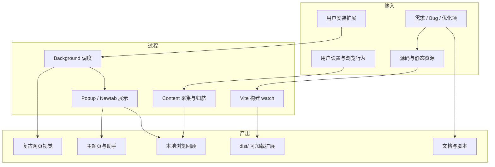
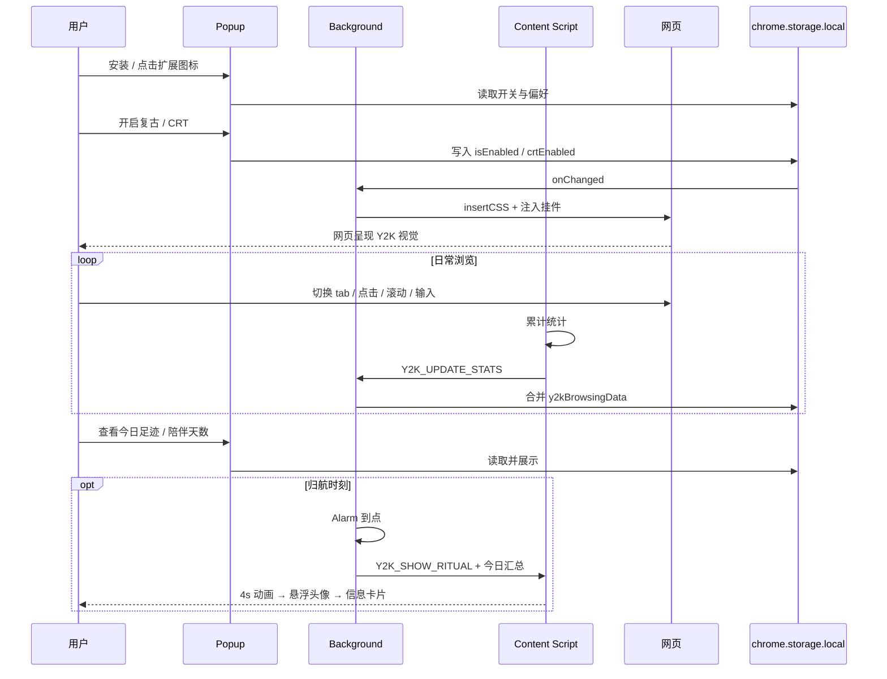
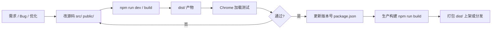

# Y2K-ifier 任务背景与产出流程说明

> 用于项目立项、交接、评审或对外说明：交代「为什么做」「做什么」「怎么产出」。

**当前版本**：1.0.6 · **文档日期**：2026-07-13

---

## 一、任务背景

### 1.1 行业与场景背景

现代网页普遍采用扁平化、圆角、无衬线字体等当代设计语言，与 2000 年代初「个人主页、论坛、门户」的视觉记忆形成鲜明反差。Y2K / 90s 复古审美在社交媒体、设计社区持续回潮，但**普通用户缺少一种低门槛、可日常使用的手段**，在真实浏览场景里复现这种风格。

与此同时，Chrome Web Store 对扩展的**单一用途、权限最小化、隐私合规**要求趋严。许多「多功能工具箱」类扩展难以通过审核或难以长期维护。因此需要一款**目的清晰、纯前端、数据本地化**的扩展，在合规前提下交付怀旧体验。

### 1.2 问题定义

| 问题 | 具体表现 |
|------|----------|
| **价值呈现晚** | 用户装完扩展后，需自己「开开关 → 打开网页 → 才看到效果」，容易在第一步流失 |
| **缺少日常触点** | 最有氛围的主题页藏在选项/弹窗入口，未与高频浏览行为自然绑定 |
| **只有「看」没有「留」** | 纯滤镜类产品用完即走，缺少轻量、可回看的本地记录 |
| **合规与体验矛盾** | 想做「浏览回顾」但不能滥用 `history` 权限或上传用户数据 |

### 1.3 任务目标

**主目标**：开发一款 Manifest V3 Chrome 扩展，通过 CSS 注入将任意普通网页的装饰性视觉重塑为 2000 年代复古风格，并提供主题页与本地粘性功能，形成可日常使用的怀旧浏览体验。

**子目标**：

1. **核心可用**：复古 / CRT 开关、全局注入、中英双语、快捷键打开主题页
2. **合规上架**：单一用途、权限可解释、零第三方数据上报
3. **增强留存**：陪伴天数、晨间问候、归航时刻、今日足迹、剪贴板历史
4. **可维护交付**：Vite + Vue 3 + TypeScript 工程化，文档与启动脚本齐全

### 1.4 约束条件

| 类型 | 约束 |
|------|------|
| **平台** | Chrome Manifest V3；Service Worker 作 Background |
| **架构** | 纯前端，无后端；禁止依赖 `unsafe-eval`（vue-i18n 使用 runtime 构建） |
| **隐私** | 数据仅存 `chrome.storage.local`；不覆盖默认新标签页 |
| **注入范围** | 仅装饰性 CSS + 少量 DOM 挂件；不改页面布局与业务逻辑 |
| **排除 URL** | `chrome://`、`edge://`、`about:`、扩展页、Chrome 商店 |

### 1.5 当前任务阶段

| 阶段 | 状态 | 说明 |
|------|------|------|
| 基础视觉注入 | ✅ 已完成 | retro.css + Background 注入引擎 |
| 主题页 + 怀旧助手 | ✅ 已完成 | XP 壁纸、搜索、50 条预设话术、随机书签 |
| 粘性功能 | ✅ 已完成 | 陪伴、问候、归航、足迹、剪贴板 |
| 工程与文档 | ✅ 已完成 | DEVELOPMENT.md、一键 `npm start` |
| 体验优化 | 🔄 进行中 | 打开失败提示、壁纸缺失说明、书签权限引导等 |
| 中长期迭代 | 📋 规划中 | 怀旧助手 RAG、多主题皮肤、可选 newtab 覆盖 |

---

## 二、产出流程总览

本项目存在两条并行的产出链路：**用户侧产品产出**与**开发侧工程产出**。



---

## 三、用户侧产出流程（产品链路）

从用户安装到获得价值，完整流程如下。

### 3.1 流程图



### 3.2 分阶段说明

#### 阶段 A：安装与首次感知

| 步骤 | 动作 | 产出 |
|------|------|------|
| A1 | 用户加载 `dist/` 扩展 | 扩展出现在工具栏 |
| A2 | Background `onInstalled` 写入默认开关 | 复古、CRT 默认开启 |
| A3 | 用户打开 Popup | 看到开关、主题页入口、语言切换 |

**阶段产出**：用户可在 1～2 次点击内理解扩展用途。

#### 阶段 B：核心视觉重塑

| 步骤 | 动作 | 产出 |
|------|------|------|
| B1 | 用户切换复古 / CRT | storage 状态更新 |
| B2 | Background 监听并注入 | 当前及新加载 tab 应用 retro.css |
| B3 | executeScript 添加 class 与挂件 | 3D 按钮、扫描线、跑马灯等 |

**阶段产出**：任意普通 HTTP/HTTPS 页面呈现 Y2K 复古外观。

#### 阶段 C：主题页与助手

| 步骤 | 动作 | 产出 |
|------|------|------|
| C1 | Popup「打开主题页」或 Alt+Shift+Y | 新 tab 打开 XP 主题页 |
| C2 | 用户搜索或切换引擎 | 跳转 Google/Bing/百度 |
| C3 | 怀旧助手随机话术 / 书签 | 90s 风格互动与书签 rediscovery |

**阶段产出**：独立的 Y2K 首页场景，兼作扩展选项页。

#### 阶段 D：本地数据积累（粘性功能）

| 步骤 | 动作 | 产出 |
|------|------|------|
| D1 | 打开 Popup / 主题页 | 活跃日 +1 → 陪伴天数与里程碑 |
| D2 | Content 持续统计 | 今日足迹（URL、时长、点击等） |
| D3 | 用户复制文本 | 剪贴板历史（最多 10 条） |
| D4 | 归航 Alarm 触发 | 归航日期记录 + 动画与今日卡片 |

**阶段产出**：可回看的「今日浏览摘要」与长期使用的心理锚点。

### 3.3 用户侧最终产出清单

| 产出物 | 形态 | 触达位置 |
|--------|------|----------|
| 复古网页 | 实时 CSS 变换 | 任意普通 tab |
| CRT 效果 | 扫描线 + 跑马灯 + 挂件 | 开启 CRT 的 tab |
| 主题页 | XP 壁纸 + 搜索 + 助手 | 新 tab（主动打开） |
| 今日足迹 | 当日访问列表 | Popup |
| 归航报告 | 统计 + 时间轴 + 叙事卡片 | 当前页浮层 |
| 陪伴徽章 | 天数 + 里程碑 | Popup |
| 剪贴板历史 | 最近复制文本 | Popup |

---

## 四、开发侧产出流程（工程链路）

从需求到可交付扩展包的研发流程如下。

### 4.1 流程图



### 4.2 分阶段说明

#### 阶段 1：环境准备

```bash
cd Y2K-ifier
npm start    # 或 npm install && npm run dev
```

| 输入 | 过程 | 产出 |
|------|------|------|
| Node.js 18+、源码仓库 | `scripts/start-dev.sh` 检查环境并 watch 构建 | `dist/` 目录 + 终端 watch 进程 |

#### 阶段 2：功能开发

| 模块 | 主要文件 | 典型改动 |
|------|----------|----------|
| 注入引擎 | `src/background/background.ts` | 注入逻辑、alarm、足迹汇总 |
| 页面统计 / 归航 | `src/content.ts` | 统计、动画、消息处理 |
| 弹窗 UI | `src/popup/App.vue` | 开关、足迹、归航设置 |
| 主题页 | `src/newtab/` | 搜索、助手、壁纸 |
| 复古样式 | `public/styles/retro.css` | 视觉规则 |
| 文案 | `src/locales/*.ts` | 中英文案 |
| 清单 | `vite.config.ts` | 权限、manifest |

**产出**：源码变更 + Vite 自动输出到 `dist/`。

#### 阶段 3：验证与重载

| 改动类型 | 开发者动作 |
|----------|------------|
| Background | `chrome://extensions/` 重新加载扩展 |
| Content / retro.css | 重载扩展 + **刷新目标网页** |
| Popup / Newtab | 重载扩展 + 重新打开 UI |

**产出**：本地可复现的功能验证结果。

#### 阶段 4：构建与发布

| 步骤 | 命令 / 动作 | 产出 |
|------|-------------|------|
| 更新版本 | 修改 `package.json` version | manifest 版本同步 |
| 生产构建 | `npm run build` | 最终 `dist/` |
| 上架前检查 | 图标、壁纸、权限说明、minify 可选 | 可提交 Chrome Web Store 的包 |
| 文档同步 | README、DEVELOPMENT.md、商店文案 | 交接与审核材料 |

### 4.3 开发侧最终产出清单

| 产出物 | 路径 / 形态 | 用途 |
|--------|-------------|------|
| 可加载扩展 | `dist/` | 本地调试 / 用户安装 |
| 源码 | `src/`、`public/` | 持续迭代 |
| 开发文档 | `docs/DEVELOPMENT.md` | 架构、模块、测试 |
| 启动脚本 | `scripts/start-dev.sh` | 一键开发环境 |
| 业务说明 | `docs/业务逻辑与开发任务.md` | 任务与迭代清单 |
| 商店材料 | `docs/chrome-web-store-listing.md` | 上架描述与权限解释 |

---

## 五、数据产出流程（本地记录如何变成用户价值）

扩展采集的数据**不离开本机**，其产出流程如下：

```
用户浏览行为
    ↓
Content Script 统计（点击 / 滚动 / 输入 / 可见停留）
    ↓
Background 合并（tab 切换时补全 URL / 标题 / favicon）
    ↓
chrome.storage.local 持久化
    ↓
Popup 列表展示 / 归航卡片汇总 / 陪伴天数计算
    ↓
用户获得「今日看了什么」「到点收工复盘」「用了多少天」
```

| 存储键 | 输入来源 | 最终呈现 |
|--------|----------|----------|
| `y2kBrowsingData` | tab + content 统计 | 今日足迹、归航时间轴 |
| `y2kActiveDays` | 打开 Popup / 主题页 | 陪伴天数、里程碑徽章 |
| `y2kRitualDates` | Alarm 触发 | 本月归航次数、连续天数 |
| `y2kClipboardHistory` | copy 事件 | 剪贴板历史列表 |
| `isEnabled` / `crtEnabled` | 用户开关 | 网页视觉状态 |

**原则**：行为真实、用途明确、可关闭、不上传——数据是体验的副产物，而非独立商品。

---

## 六、产出验收标准

### 6.1 产品验收

- [ ] 在普通 HTTPS 页面开启复古后，按钮/字体/圆角/滚动条明显变化
- [ ] CRT 开启后出现扫描线与跑马灯
- [ ] 快捷键与 Popup 均可打开主题页
- [ ] 今日足迹能反映当天实际访问与停留
- [ ] 归航预览 / 到点触发能出现动画与信息卡片
- [ ]  restricted URL 不注入、不报错

### 6.2 工程验收

- [ ] `npm start` 可启动 watch 并成功生成 `dist/`
- [ ] `dist/manifest.json` 版本与 `package.json` 一致
- [ ] Popup / Newtab / Background / Content 改动后重载流程清晰
- [ ] 中英文案 key 成对存在
- [ ] 无第三方网络请求（除用户主动搜索跳转）

---

## 七、相关文档

| 文档 | 内容 |
|------|------|
| [README.md](../README.md) | 产品简介与安装 |
| [docs/DEVELOPMENT.md](./DEVELOPMENT.md) | 开发指南 |
| [docs/业务逻辑与开发任务.md](./业务逻辑与开发任务.md) | 业务逻辑与任务清单 |
| [docs/TESTING-RITUAL.md](./TESTING-RITUAL.md) | 归航功能测试 |
| [docs/retention-and-ux-thinking.md](./retention-and-ux-thinking.md) | 留存与 UX 思路 |
| [docs/chrome-web-store-listing.md](./chrome-web-store-listing.md) | 商店上架材料 |

---

**Stay Retro, Stay Y2K!**
